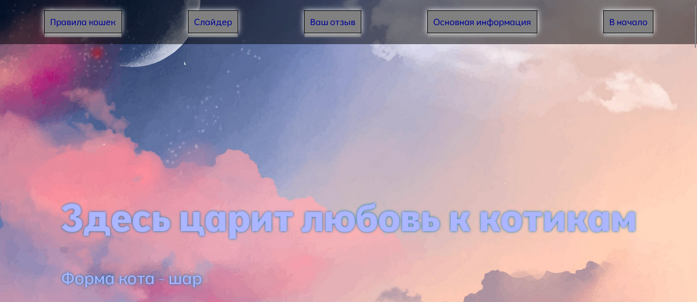
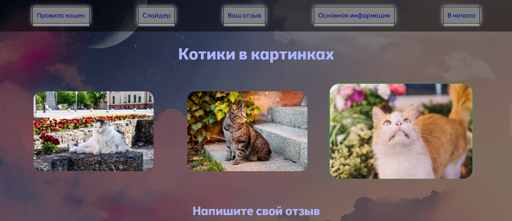
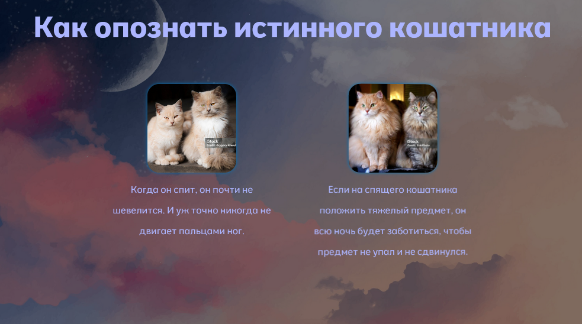
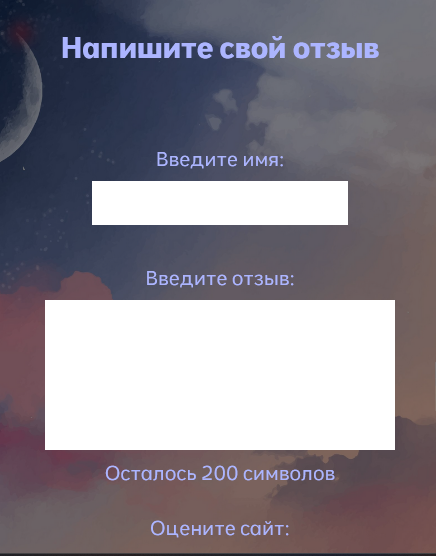

# О котиках с любовью
Одностраничный, адаптивный лендинг "О котиках с любовью" - это первый пет-проект, созданный для демонстарции навыков фронтэнд-разработки. 

В нем  содержится некоторая информация легко-юмористического характера о котах, реализация приятного и функционального интерфейса с помощью:
html, scss, JS(vanilla), без фреймворков. 

## Прилагаю скриншоты:
1. Главный экран  2. Слайдер  3. Флип-карты  4. Форма ;

## Технологии, использованные в проекте: 
1) Сборка через Gulp;
2) Адаптивная верстка(Flex, media quaries, grid);
3) SCSS-препроцессор;
4) Кроссбраузерная совместимость;
5) Семантическая верстка;
6) JavaScript (ES6+).
7) 
## Возможности:
Адаптивный дизайн на разных размерах(от мобайл до больших экранов), интерактивная форма с валидацией и счетчиком символов, чистый читабельный код, легкий к восприятию контент, флип-карты, а также бесконечный слайдер.
